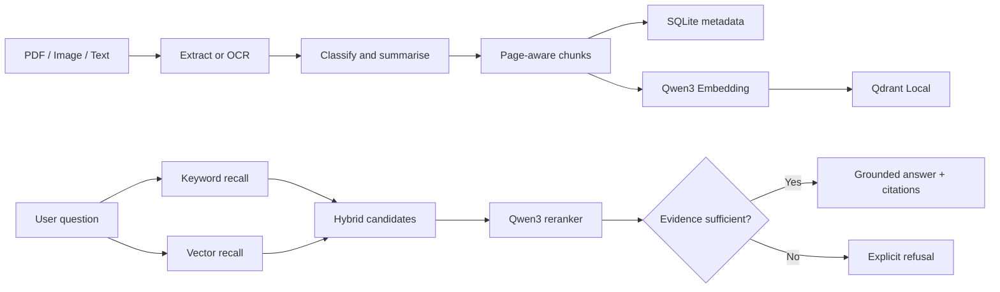

# Recall — Personal Knowledge RAG Case Study

> 一个以“答案有据可查、证据不足就拒答”为核心原则的本地个人知识库产品。

## Project snapshot

| 项目维度 | 内容 |
|---|---|
| 产品类型 | 本地优先的个人文档 RAG 知识库 |
| 我的角色 | AI 产品设计、RAG 方案设计、前后端实现、评测设计 |
| 输入 | PDF、扫描 PDF、图片、手动文字 |
| 输出 | 自动分类、摘要、自然语言回答、页码级引用 |
| 核心模型 | Ollama + Qwen3、Qwen3 Embedding、Qwen3 0.6B Reranker |
| 数据层 | SQLite + Qdrant Local |
| 约束 | 免费、本地运行、隐私优先、无需 Dify |

## 1. Problem

用户读过大量 PDF、课程资料和截图，但真正需要使用知识时，往往只记得“我好像看过”，无法快速找到原文，更难判断 AI 的答案是否可信。

传统文件搜索只能匹配关键词；普通聊天模型可以生成流畅答案，却容易脱离用户资料。Recall 要解决的不是“让模型回答更多”，而是三个更具体的问题：

1. 如何低成本地把不同格式内容沉淀为可检索知识；
2. 如何从资料中找到真正能够回答问题的证据；
3. 如何让用户验证答案，并在证据不足时避免模型编造。

## 2. Product principles

- **Source grounded**：重要结论必须能回到原始片段和 PDF 页码。
- **Abstention first**：不知道时明确拒答，比给出无依据答案更重要。
- **Local first**：文档、向量和模型默认留在用户电脑。
- **Evaluated, not assumed**：每次检索升级都用同一组问题验证收益和代价。

## 3. User flow

1. 用户上传 PDF、图片，或粘贴一段文字；
2. 系统提取文本，扫描页和图片进入 OCR；
3. Qwen3 生成摘要并复用或创建分类；
4. 文本按段落与 PDF 页码切块；
5. Embedding 写入本地 Qdrant，元数据写入 SQLite；
6. 用户提问后，系统执行关键词召回、向量召回、重排和证据充分性判断；
7. 证据充分时生成带引用答案，否则明确说明知识库不足。

## 4. Why the retrieval system changed

### V0 — Keyword baseline

先建立可解释、速度快的关键词基线。它在用户和原文措辞接近时效果很好，但无法稳定连接“向量化有什么作用”和原文中关于数字、距离、相似度的解释。

### V1 — Embedding recall

加入 Qwen3 Embedding 后，所有可回答问题的正确页面都能进入 Top 5。但单独使用语义相似度时，同主题文档中的“相关但不回答问题”片段更容易排在第一位，Hit@1 反而下降。

### V2 — Hybrid + Reranker + evidence gate

最终方案合并关键词与向量候选，再由小模型做相对排序。检索分数仍占最终排序的主要权重，避免生成模型完全覆盖可解释的召回信号。随后由较强模型独立判断证据是否足以回答，再决定是否生成答案。

## 5. Evaluation

评测集包含 45 个手工标注问题：35 个可回答问题和 10 个知识库外问题。标签记录正确 PDF 页码及是否应该拒答。

| Version | Hit@1 | Hit@3 | Hit@5 | MRR@5 | 拒答准确率 | 错误拒答 | 平均检索延迟 |
|---|---:|---:|---:|---:|---:|---:|---:|
| V0 Keyword | 82.9% | 97.1% | 97.1% | 0.900 | 80.0% | 14.3% | 1 ms |
| V1 Embedding | 77.1% | 94.3% | 100.0% | 0.867 | 80.0% | 14.3% | 93 ms |
| V2 Hybrid + Reranker | **85.7%** | **100.0%** | **100.0%** | **0.919** | **100.0%** | **0.0%** | 9.5 s |

关键结论不是“Embedding 一定更好”，而是：

- Embedding 提升候选覆盖率，但不能保证首位证据最准确；
- Reranker 的价值是改善候选排序，不应代替召回信号；
- 排序与“是否足以回答”必须拆成两个任务；
- 当前质量提升以延迟为代价，V2 检索平均耗时约 9.5 秒。

完整原始结果见 [Evaluation Results](EVALUATION_RESULTS.md)，失败分析见 [Bad Case Analysis](BAD_CASE_ANALYSIS.md)。

## 6. Bad cases that changed the product

### Bad case A：语义相关不等于能够回答

Embedding 会将同一主题的多个页面排在前面，但这些页面不一定包含问题所需事实。因此加入二阶段重排，并把“是否直接回答问题”作为排序目标。

### Bad case B：小模型会在无答案时选出“最不差”的片段

把重排和充分性判断放在一个提示词里时，0.6B 模型对 10 个知识库外问题全部错误放行。解决方案是拆分职责：小模型只排序，较强模型单独做严格的 evidence gate。

### Bad case C：过于严格的 gate 造成错误拒答

第一版严格 gate 错误拒绝了 7 个有答案的问题。最终增加语义证据下限作为保护条件。但该阈值是在当前数据上校准的，不能被当作通用参数。

## 7. Product and UX decisions

- 在等待界面展示召回、重排、证据核验和生成阶段，让高延迟可理解；
- 答案旁展示原文片段、文件名和 PDF 页码；
- 将内部检索分数称为“证据匹配度”，避免伪装成概率意义上的可信度；
- 在线版本明确标记为静态演示，只开放预置问题，不伪装成实时模型；
- 上传、OCR 和任意问题问答保留在本地完整版本。

## 8. What I would improve next

1. 扩展到至少 5–10 份不同领域文档和 100 个问题；
2. 拆分阈值校准集与 held-out test set；
3. 增加 claim-level citation accuracy、答案完整度和人工评分；
4. 比较生成式 reranker 与专用 cross-encoder；
5. 为问答增加超时恢复、重试和端到端测试；
6. 用远程推理与托管向量库构建真正可自由提问的在线版本。

## 9. Demo boundary

GitHub Pages 版本用于展示产品流程、交互、评测结果和三组预置问答。它不上传用户文件，也不在浏览器中运行 Qwen3。真实 PDF/OCR/Embedding/Reranker 流程需要按照仓库 README 在本地启动。

This boundary is intentional: the demo demonstrates the product truthfully without pretending that a static website contains a live RAG backend.
